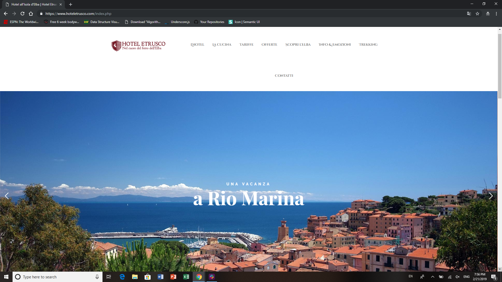

#Semantic UI Overview
-----


 
 
 
If you're like me, you are a novice at best when it comes to web development. I myself just a week ago was only able to create web pages that were cutting edge before Y2K. I have fond memories of the 90's, but I don't want to take future customers on a trip down memory lane when they view the product I'm trying to create for them. For an idea of what I'm talking about, you can see some websites from the 90's that are still active [here](http://www.cnn.com/US/OJ/), [here](http://www.dolekemp96.org/main.htm), or [here](http://www.fogcam.org/). (The fog cam still updates 25 years later!)


With Semantic UI, your webpages can easily be converted from ugly blue hyperlinks, goofy icons, and pixelated pictures, like the still active CNN O.J. Simpson trial page, circa 1996, in the hyperlink above to something modern and sleek.


-----


 
 
 
 
 The preceding website was built with Semantic UI (in addition to a few other technologies). The location for the hotel may be beautiful, or maybe that's just how good Semantic is at creating webpages, I can't tell. 
 
 [You can find Hotel Etrusco's website here](https://www.hoteletrusco.com/index.php)
 
 So you've seen a solid representation of what can be achieved using Semantic UI, but that's not even the best part! Semantic UI uses natural language syntax, which means the code you write reads more like English and less like weird computer speak that programmer's normally deal with. For instance, I used Semantic to format the images I provided on this page:
 
 The top image: 
   ````img class="ui large middle floated rounded image" src="../images/semantic.png"````
 
        
 
 Hotel Etrusco's webpage: 
 ````img class="ui fluid image" src="../images/hoteletrusco.png"````
 
 
 The portions after the "class" tag are what I'm referring to. For the top image, "ui large middle floated rounded image" indicates I want a large image, that is middle aligned, floated, and rounded on the corners. Pretty simple, right?
 
 The second is a little less intuitive, but a quick look through the [Semantic UI documentation for images](https://semantic-ui.com/elements/image.html) shows us that the "fluid" keyword means the image will be sized to fit the page.
 
 As you can see, Semantic UI is a great tool to create fast, quality websites. The keywords are incredibly simple, so learning this framework is not nearly as daunting as the html and CSS it's built upon. Even an experienced web developer can gain from using this simple yet effective framework.
 
 


