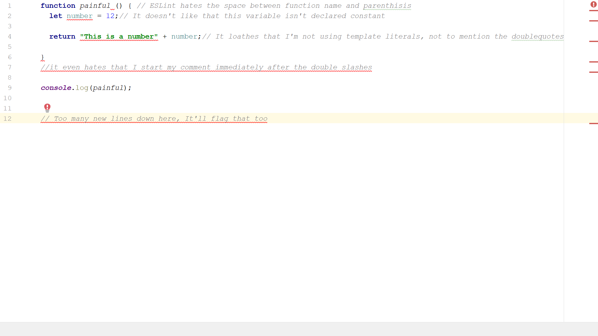

 

# Coding Standards with ESLint
### (Or How to not Look Like a Rookie with ESLint)

 

----

If you talk to an ICS 314 student, you are liable to get a mixed array of responses regarding ESLint. Many have not-so-positive views on how it aggressively enforces the standards, such as forcing a new-line entry at the bottom of your code, or how it will flag on anything but template literals when printing text. 

I find myself leaning towards the other camp. I find nothing more satisfying than sighting the little green checkmark in the upper right-hand corner of my IDE, letting me know that my code may not be right, but at least it looks good. I know my code is crisp, clean, and above all, easy to read.

 

This is where the importance of ESLint comes into play. Yes, I think that some of the areas it hits are frivolous. Do I think it's necessary that every single line is uniformly spaced? Or that template literals are used instead of the classic, tried-and-true method of using plus-symbols between strings and variables to print them to the console? No, I do not. I have, however, written code that I would attempt to come back to at a later date, and struggle to read through. ESLint shields you from this problem with extreme prejudice.

 

Moving on to the subject of IntelliJ, I love IntelliJ. IntelliJ was the second IDE I was introduced to, the first being JGrasp. I don't want to badmouth JGrasp, but you can think of JGrasp as those absurdly large Legos they give to infants. They're not really designed to be fun or that useful, they just don't want you playing with a choking hazard when you're that young. IntelliJ would be standard-sized Legos. You're able to do MUCH more with them, but there's the choking hazard, and even if you don't do that, have you ever stepped on a Lego? It is definitely one of the top-ten most painful events a human being can endure.

 

Well, when you begin to use IntelliJ, it's like you're standing barefoot in a seemingly never-ending sea of Legos. It's fun that you're able to do much more, but it's an excruciating experience. You cruise along for a while, thinking you've made it, and all of the sudden you realize your settings changed, and the error free code you think you wrote has a rap-sheet of ESLint violations that you were unaware of because when you restarted your computer, IntelliJ seemed to think you no longer wanted it on! But, other than that, IntelliJ is great.

In summary, ESLint may feel overbearing, but in the end is your friend. The pain of having errors flagged for what you think are trivial errors is nowhere near the shame of sharing ugly code with your peers. IntelliJ has some growing pains, but fight through it, and you'll learn to avoid stepping on the "Legos" IntelliJ leaves for you.
