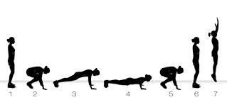

<div class="ui small rounded images align:center">

</div>


 With my only previous programming experience being in the languages of Java and C/C++, there were many elements that I initially found strange. Declaring variables was definitely different. Java and C are both strongly typed languages, which means each variable has a type declared upon instantiation. Javascript, however, is weakly typed. The keyword _let_ is used to declare your variable, with no mention of a type. You can also omit _let_ altogether, leaving the variable globally accessible. This can be a dangerous mistake.
 
 ````javascript
   let x = 1;
   let y = false;
   let z = " a string"
````
 
 The second area that is in stark contradiction with my traditional Java upbringing is functions. For one, they are declared with the keyword _function_. I'm a fan, it's stupid-simple syntax that makes it easy for someone who has never written a program in their life to understand. Aside from this, the syntax for functions is largely the same, variables are passed as parameters in the same way, the _return_ keyword is used, etc. 
 
 A powerful difference in how functions operate in Javascript, is the fact that there is no return-type declared. The same function could return different variable types for different situations, for instance, integers for some values and an error statement in the form of a string for others. Although it seems like a beautiful thing, I am certain this method has draw backs that are to be discovered later on down the line.
 
 
   ````javascript
   function returnWhatever(integer) {
	    switch(integer) {
  	    case 0:
    	    return 1;//returns an integer
          break;
        case 1:
    	    return true;//returns a boolean
	    break;
        default:
    	    return: "It's ok, return whatever you want!";//returns a string
	    break;
  }
}
   ````
  
   
Arrays are another noteworthy topic when reflecting on Javascript. I don't know this for a fact, but I'm sure all, if not almost all programming languages support the array data type, and Javascript is no different. Those of you who were baptized in the Church of Java or C, as I was, are used to using an array to store a single data type, every index conforming to this rule. Javascript is a rule breaker in this aspect. Javascript is an equal-opportunity index programming language, where all data types are welcome in a single array.
   
   ```javascript
   let variable = [1, 'shoe', true, 3.14];//four different data types in one array!!!!
   ```
    
    
While on the topic of arrays, I have to discuss _push(), pop(), shift,_ and _unshift_. These are by far my favorite features in this language. _push()_ and _pop()_ are methods built into Javascript that allow an array to easily be used as a stack, which is a last in, first out data structure. These methods "push" data on the end of the array, and "pop" it off, respectively. _shift()_ removes the item in the first index, and when used in conjunction with _push()_ allows us to implement a queue(first in, first out) data structure. _unshift()_ is the inverse of _shift()_, meaning that it inputs an item at the front of the array, shifting each other element one to the right.
    
   ```javascript
    let variable = [1, 'shoe', true, 3.14];
    
    variable.pop();//this will pop the value 3.14 from the array, just like a stack
    
    variable.push(3.14);//this pushes 3.14 back on the end of the array
    
    variable.shift();//removes the first item from the array, and shifts the remaining values to the left one space (like a queue)
    
    variable.unshift(1);//puts 1 back at the front of the array, shifting everything else one to the right
  ```
  
  
  
<div class="ui small rounded images align:center">

</div>
   
   
In contrast with the simplicity of how Javascript implements arrays, JSON (Javascript Object Notation) is still a perplexing mystery to me. I used to lie awake at night, pondering the origins of the universe. That time is now spent wondering how to properly implement JSON.
   
   <div class="ui small rounded images align:center">

</div>
   
   More information on JSON can be found at https://www.w3schools.com/js/js_json.asp
   
  The last concept I was introduced to in this section was the concept of the Athletic Software Engineering approach, and Workouts of the day (WoD). The best analogy I can provide is that they are computer science's equivalent to a burpee. For those of you who are unfamiliar with the burpee, it's a cardiovascular exercise that incorporates push-ups, squats, and a jump, all rolled into one exercise. They are outrageously effective in developing strength and stamina, and when I was a little closer to my prime, I did them often with great results. With that being said, I HATE burpees. I did them because I know they get results, certainly not for my enjoyment. I have similar sentiments with WoD's. I am sure they will garner results, previous reviews don't lie, but I dread every second of them, and how easy it is for small mistakes to make huge impacts on your grade.
  
  <div class="ui small rounded images align:center">

</div>
  
  
  
  
  In conclusion, Javascript is a great beginner's programming language in my opinion. There are several features that make implementing data structures fast and easy. JSON presents a learning curve, and will require practice to become accustomed to if you have not been previously introduced to it. The Athletic Software Engineering pedagogy is effective, but high-stress method of learning computer science.
   
