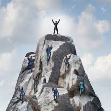

Many people might not find an A.S. that great of an accomplishment. I feel very differently.

A little history on my background, I humbly must admit that I am a college dropout. I attended Fort Hays State University in the Fall-Spring of 2010-2011. It was a disaster. I lacked the discipline to complete assignments, or often, even to show up to class. I made it halfway through the Spring 2011 semester when I finally realized I was wasting my time. It was at that point that I decided to enlist in the Navy, and many life lessons came with it.

Upon completion of my five-year contract, I knew that this time would be different. I decided to set a goal of maintaining a 4.0 GPA while in college. I failed to obtain that goal, I graduated from Leeward Community College with a 3.92 GPA. Although I didn't meet my goal, I am still proud that I was able to make such a transition. I don't provide this information to brag, but more to demonstrate that my understanding of failure and falling short of expectations has changed since the disaster that was my first attempt at college.
 
 Regardless of how things are currently, there is alway a way to improve. This applies to projects, careers, and even life in general.

