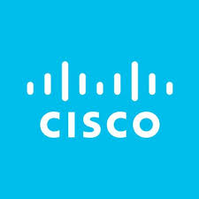

During the summer of 2017, I had the privilege of working for Native Hawaiian Veterans, LLC under Col. Stephen Wren (ret.) and Mr. John Barnette. In my position, I acted as a fiber optic cable installer, so my focus was on installing hardware and basic network troubleshooting.

The project involved the upgrade of five VTC rooms in Top Secret/Sensitive Compartmented Information (TS/SCI) facilities in support of the 500th Military Intelligence Brigade. This included four sites on Oahu and one in Alaska.

This project extended some of the basic network troubleshooting experience that I had gained through my position as a radio operator in the United States Navy. I also became familiar with proprietary equipment from Cisco, Cinemassive, Crestron, and ThinkLogical.
 
 

