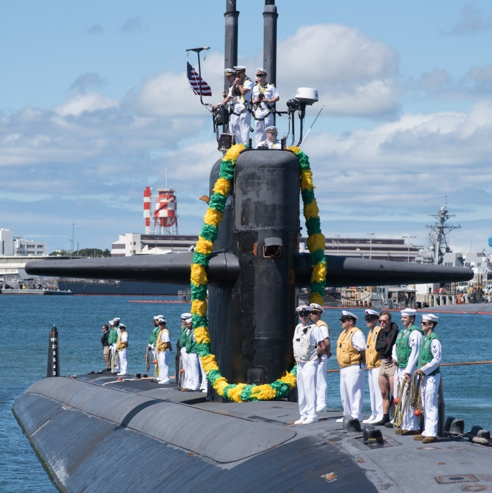
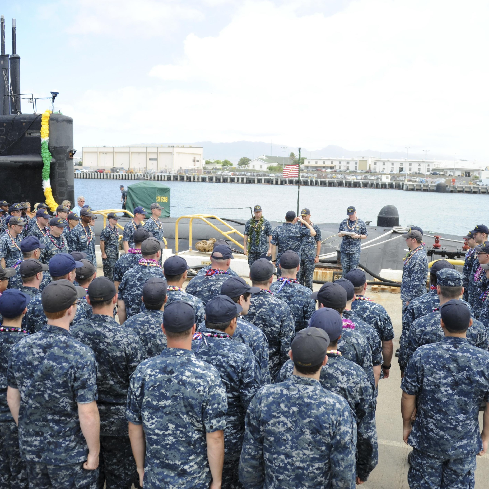
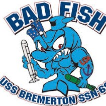

  
  
  

I was a crew member on the USS Bremerton (SSN 698), which at the time was the oldest submarine in the fleet. In preparation of this event, my fellow communications division members and myself performed countless hours of maintenance to ensure we could handle any contingency. The maintenance performed included, but was not limited to: Hydraulic and Electronic testing, Testing of various communication circuits and pathways, the removal and reinstallation of a periscope and a communications mast/antenna, and hours of training junior personnel.

Upon steaming to area, I was instrumental in the reception and transmittal of 10,000 and 1,000 messages respectively, which supported the completion of two missions of national tasking, and two joint exercises. This experience presented dynamic challenges that required teamwork and perseverance to overcome.

My time in the Navy is what spurred my interest in computer science and engineering. I was exposed to many complex systems that took a high level of critical thinking to fix. I was also exposed to many concepts in the realm of information security, including cryptography, audits, and best practices to prevent adversaries from exploiting our communications.

